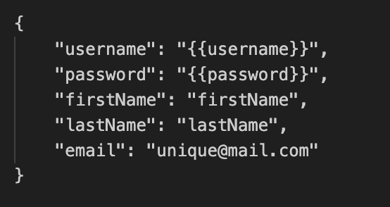
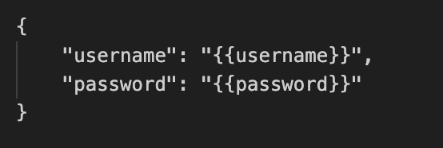
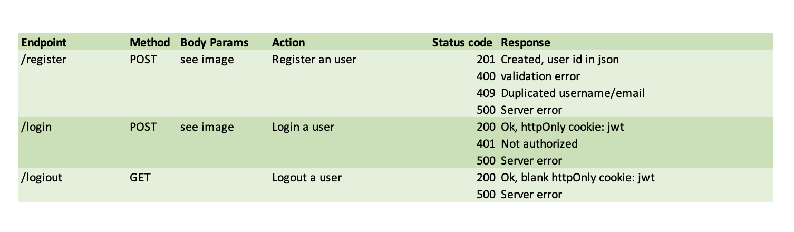

# auth-service 1.0.0

This is an authentication/authorization api used as for the application SkySecrets. 

## Endpoints
This first version has three endpoints: 
- /register
- /login
- /logout

- future endpoints:
  - /delete  
  - /update

## API Specification

### Parameters
The following data should be included to the two possible POST requests. It is send in the body as json.

- POST /register:

- POST /login:

### Endpoint specification
The following table describes the endpoints, their methods, required parameters and possible responses:

